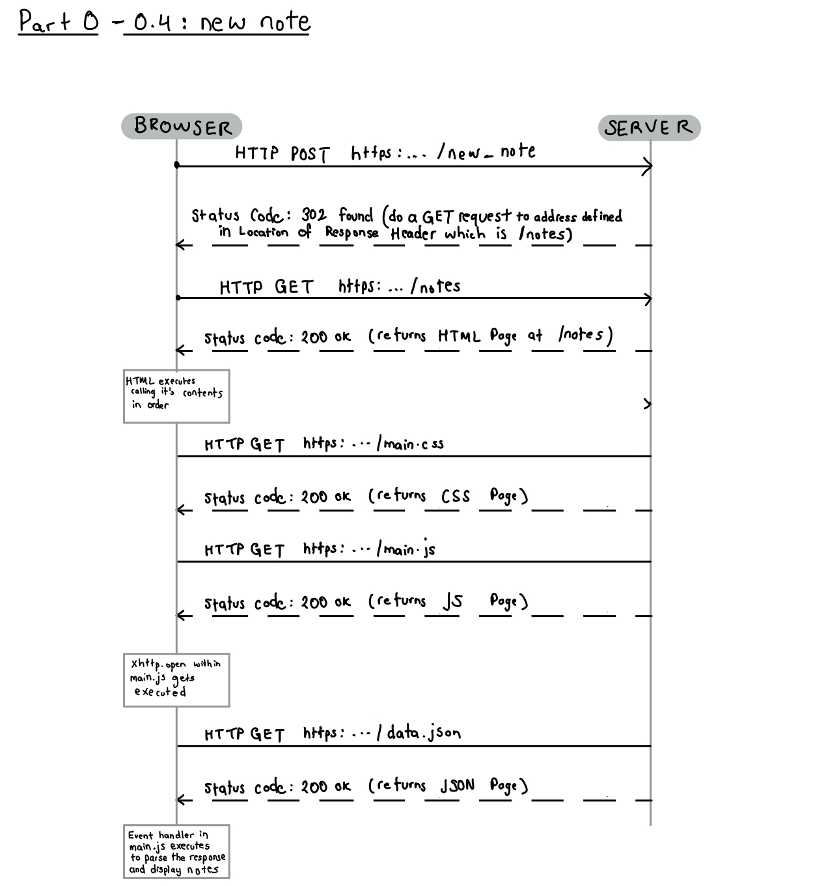
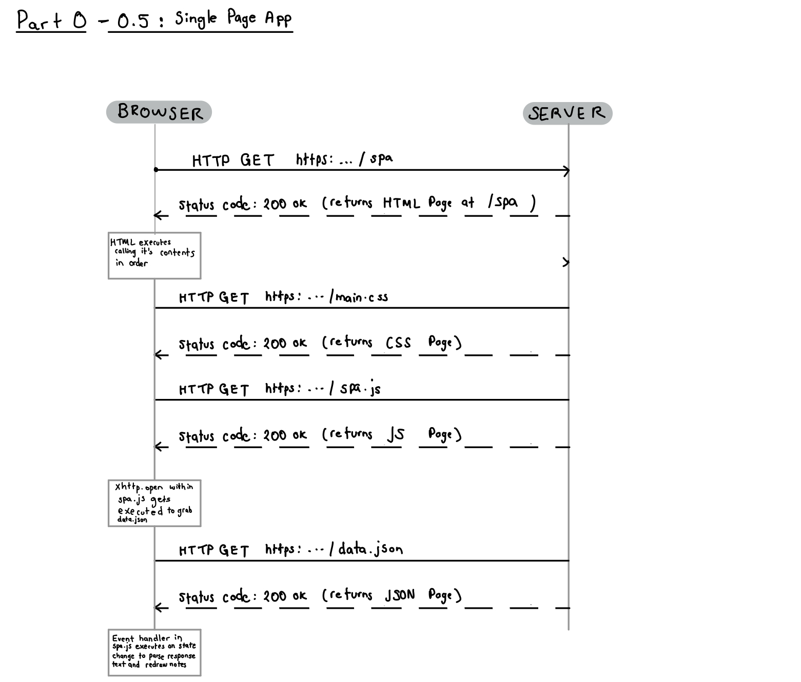
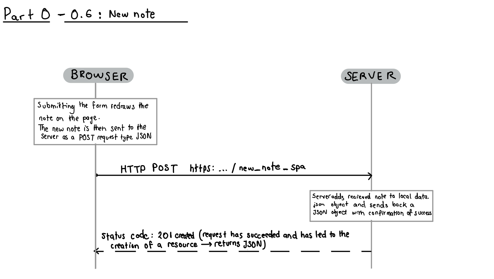

# Exercises 0.1.-0.6.

## 0.1: HTML
Review the basics of HTML by reading this tutorial from Mozilla: HTML tutorial.

This exercise is not submitted to GitHub, it's enough to just read the tutorial

## 0.2: CSS
Review the basics of CSS by reading this tutorial from Mozilla: CSS tutorial.

This exercise is not submitted to GitHub, it's enough to just read the tutorial

## 0.3: HTML forms
Learn about the basics of HTML forms by reading Mozilla's tutorial Your first form.

This exercise is not submitted to GitHub, it's enough to just read the tutorial

## 0.4: new note
Create a diagram depicting the situation where the user creates a new note on page https://fullstack-exampleapp.herokuapp.com/notes by writing something into the text field and clicking the submit button.

## 0.5: Single page app
Create a diagram depicting the situation where the user goes to the single page app version of the notes app at https://fullstack-exampleapp.herokuapp.com/spa.

## 0.6: New note
Create a diagram depicting the situation where user creates a new note using the single page version of the app.

